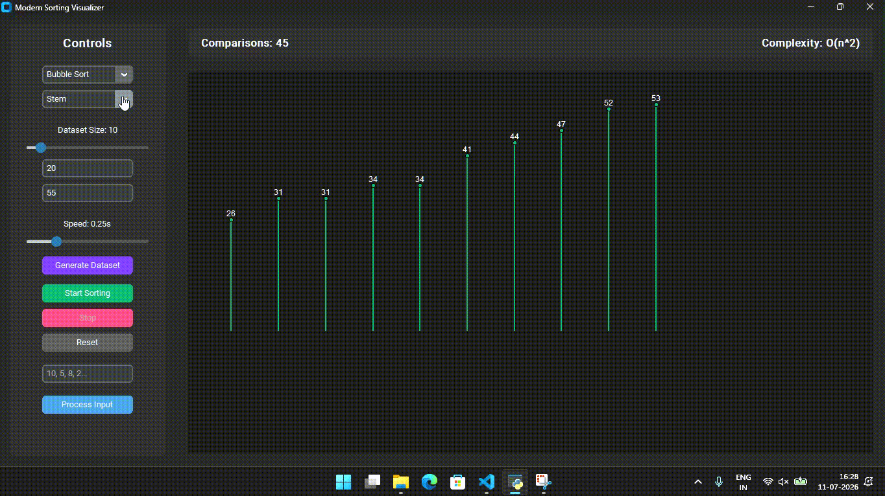
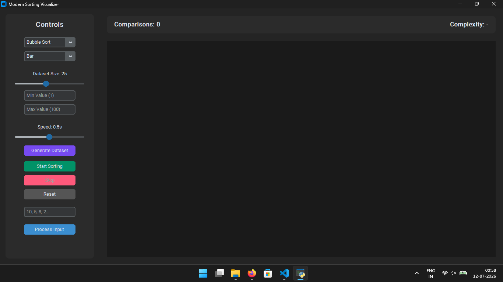
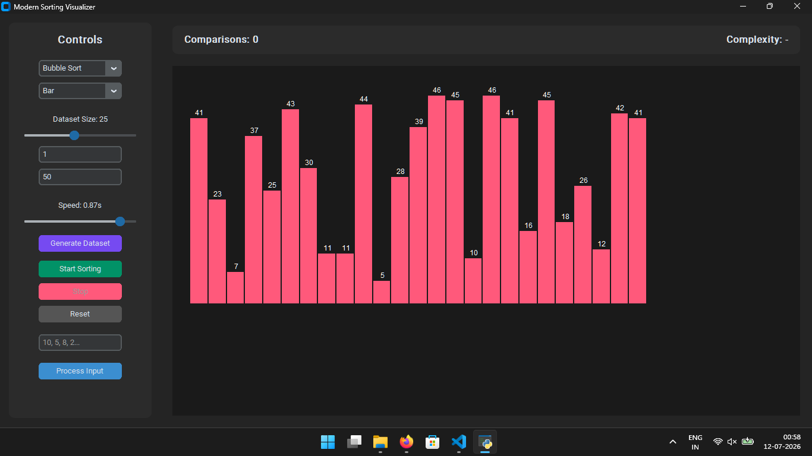
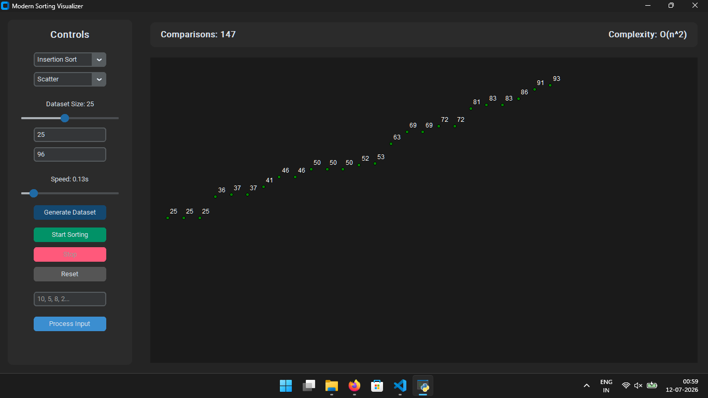
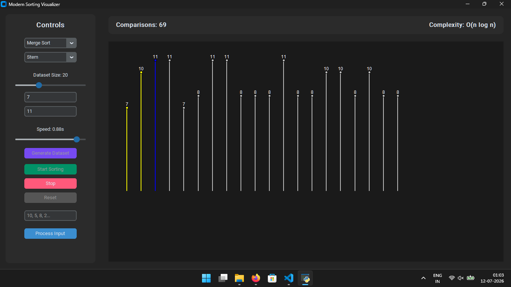

///-Modern Sorting Algorithms Visualizer-///

A sleek, modern visualization tool for various sorting algorithms implemented in Python. This project allows you to observe how different algorithms process data in real-time with a clean, dark-mode user interface.
---------------------------------------------------------------------------------------------------------------------------------------
📸 Preview
-------------------------------------------

-------------------------------------------

----------------------------------------------------------------------------------------------------------------------------------------
✨ Key Features
1.Modern UI: Built with customtkinter for a professional, glossy dark-mode experience.

2.Algorithm Variety: Visualize Bubble, Quick, Insertion, Selection, and Merge Sort.

3.Customizable Datasets: Generate random arrays or process your own custom inputs.

4.Real-time Controls: Adjust dataset size and animation speed on the fly.

5.Live Stats: Track comparison counts and time complexity in the header.
------------------------------------------------------------------------------------------------------------------------------------
🚀 Getting Started
------------------------------------------------------------------------------------------------------------------------------------
Follow these simple steps to get the visualizer running on your machine

///-Prerequisites-///
Ensure you have Python 3.10+ installed on your system.

///-Installation-///
Clone this repository to your local machine:

git clone https://github.com/sameer26412/sorting-algorithm-visualizer.git

cd sorting-algorithm-visualizer
-------------------------------------------------------------------------------------------------------------------------------------
///-Install the required dependencies-///

```bash
pip install customtkinter matplotlib
```

///-Run the Application-///
Execute the following command in your terminal:

```bash
python main.py
```
--------------------------------------------------------------------------------------------------------------------------------------
🛠️ Built With

1.Python - The logic backend.

2.CustomTkinter - For the modern, responsive graphical user interface.
--------------------------------------------------------------------------------------------------------------------------------------
📸 Screenshots




-----------



-----------



-----------



